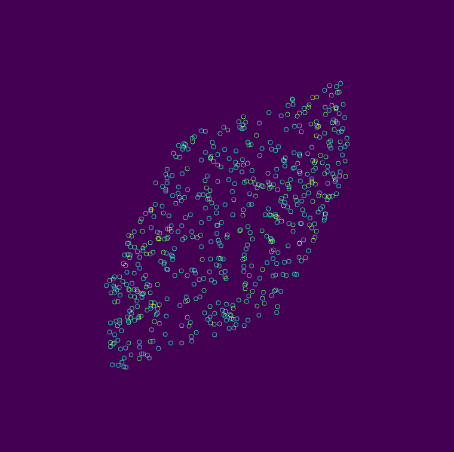
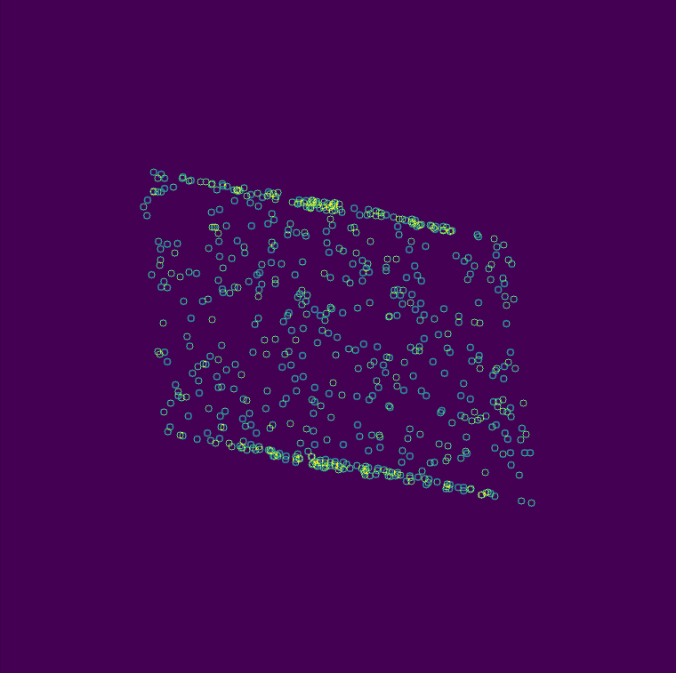
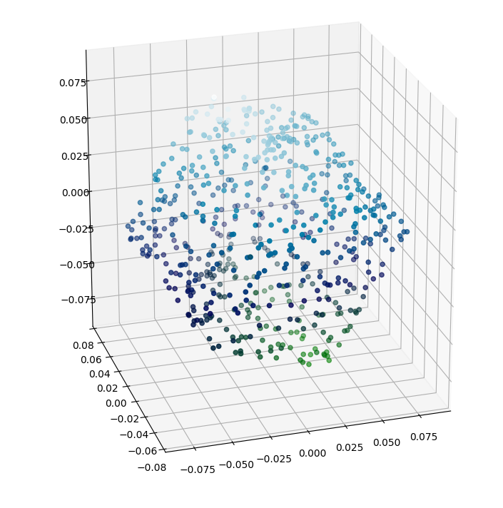
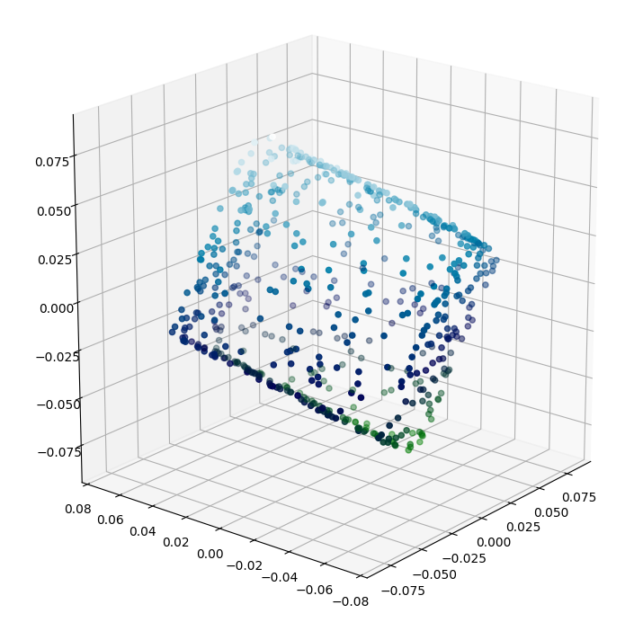

## Cube Structure from Motion

#### Description

A cube shape **whose 6000 points acquired** on **10 different frames**, **600 for each**, is reconstructed. To this end, structure from motion (SFM) technique is employed. Steps of the SFM applied to find the **600 3D world points of the shape** within the **10 camera matrices**. After finding the 3D world points and camera matrices, these information are used to show both **reconstructed points in 3D** and **projected points in 2D**.

#### Algorithm Steps

Steps to calculate the 600 3D world points and 10 camera matrices are;

- First of all, X and Y locations of the points, in a shape of 600 x 10 matrix, are read.

- For each frame, mass of the points are calculated and they are subtracted from each point in the frame. So that, unknown camera matrices are removed from the equations and it enabled to write a matrix equation for both motion and structure.

- Then by using centered points, the measurement matrix D containing these centered points, is formed. This matrix is in a shape of 20 x 600 which implies 600 X and Y points in one frame and 20 x 600 in all frames.

  

- The D matrix is fed into SVD decomposition method create the motion and structure matrices containing camera parameters and 3D world points respectively. First three columns of the retrieved U matrix, in a shape of 20 x 3, was multiplied with singular values, in a shape of 3 x 3 to retrieve the camera matrices in a shape of 20 x 3. Also, the first three column of the the retrieved vT matrix was employed as the 3D world points.

#### Algorithm Results

To project the 3D world points in 2D image plane, the affine projection matrix is generated.

  

In order to generate the projection matrix;

- For a one camera, its camera matrix in a shape of 2 x 3 is retrieved and the translation vector, in a shape of 2 x 1, of the camera is retrieved as the calculated mass of points for that frame or camera.

- Then the camera matrix and translation vector is combined, in a shape of 2 x 4, to from the upper side of the projection matrix and the bottom row of the project matrix is appended as [0, 0, 0, 1]. So that the affine projection matrix is created in a shape of 3 x 4.

-  All of the 3D world points is updated to be in homogeneous format, shape of 4 x 1, and multiplied with the projection matrix to project the points in 2D image plane. After all, these 2D points are shown with 2D plot to show the projection of a cube in 2D.

   &nbsp &nbsp &nbsp
  
  

  
In addition to 2D projection, 3D plots of the cube are given below to ensure the shape is correctly reconstructured.

   
  
  

